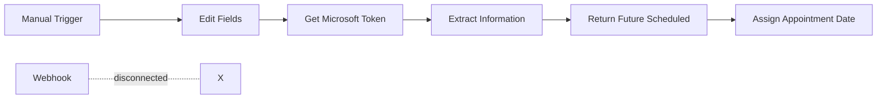

# Hiring Scheduler Workflow - Security Audit & Best Practices Analysis

**Document Version:** 1.0
**Analysis Date:** November 3, 2025
**Workflow ID:** tGHj1QXsNbPy4LbU
**Risk Level:** 🔴 **CRITICAL**
**Status:** ⚠️ **Inactive** (Security vulnerabilities detected)

---

## 📋 Executive Summary

The Hiring Scheduler workflow in your n8n instance contains **critical security vulnerabilities** that require immediate attention. This analysis identified **2 critical errors**, **13 warnings**, and multiple violations of n8n best practices. Most notably, **Azure AD credentials are exposed in plaintext**, creating a severe security risk.

### Key Findings
- 🚨 **Critical**: Hardcoded Azure AD credentials (client secret, ID, tenant ID)
- 🚨 **Critical**: Sensitive PII (SSNs) in test data
- ⚠️ **High**: No error handling on any nodes
- ⚠️ **High**: Disconnected webhook trigger
- ⚠️ **Medium**: Invalid JSON configuration
- ⚠️ **Medium**: Missing monitoring and notifications

### Immediate Actions Required
1. **Rotate compromised Azure AD credentials immediately**
2. **Remove workflow from production until fixed**
3. **Implement proper credential management**
4. **Remove all PII from workflow configuration**

---

## 🔒 Security Audit

### Critical Security Vulnerabilities

#### 1. Exposed Azure AD Credentials
**Location:** Node "Get Microsoft Token"
**Severity:** 🔴 CRITICAL

```json
// EXPOSED CREDENTIALS - DO NOT USE (VALUES REDACTED)
{
  "client_id": "[REDACTED]",
  "client_secret": "[REDACTED]",
  "tenant_id": "[REDACTED]"
}
```

**Impact:**
- Full access to Microsoft Graph API with these credentials
- Potential data breach of all accessible Microsoft 365 resources
- Compliance violations (GDPR, SOC2, ISO 27001)
- Audit trail compromise

**Required Fix:**
```javascript
// CORRECT IMPLEMENTATION
{
  "parameters": {
    "authentication": "predefinedCredentialType",
    "nodeCredentialType": "microsoftOAuth2Api"
  },
  "credentials": {
    "microsoftOAuth2Api": {
      "id": "credential_id_here",
      "name": "Microsoft Graph API"
    }
  }
}
```

#### 2. Sensitive PII in Workflow
**Location:** Node "Edit Fields"
**Severity:** 🔴 CRITICAL

- SSNs (even partial) hardcoded in workflow
- Personal employee information exposed
- Test data contains real-looking names and identifiers

**Required Fix:**
- Remove all test data from workflow
- Use environment variables or external data sources
- Implement data masking for sensitive fields

### Data Privacy Concerns

1. **SSN Handling**
   - Current: Stored in plain text
   - Required: Encryption at rest, masking in logs

2. **Personal Information**
   - Current: Full names, phone numbers, emails visible
   - Required: Access controls, audit logging

3. **Compliance Gaps**
   - GDPR Article 32: Security of processing
   - CCPA: Personal information protection
   - HIPAA: If health information involved

---

## 🔧 Technical Analysis

### Workflow Structure Review

#### Current Flow


#### Issues Identified

1. **Disconnected Components**
   - Webhook trigger exists but has no connections
   - No response sent to webhook callers
   - Dual trigger confusion (manual + webhook)

2. **Invalid Configurations**
   - "Edit Fields" node: Invalid JSON syntax (position 242)
   - "Assign Appointment Date": Returns primitive values incorrectly

3. **Missing Components**
   - No error handling nodes
   - No notification nodes
   - No logging nodes
   - No validation nodes

### Node-by-Node Analysis

| Node | Type | Issues | Risk |
|------|------|---------|------|
| Get Microsoft Token | HTTP Request | Hardcoded credentials, No error handling, No timeout | 🔴 Critical |
| Extract Information | Code | No error handling, Uses deprecated helpers syntax | ⚠️ High |
| Return Future Scheduled | Code | No error handling, No input validation | ⚠️ High |
| Assign Appointment Date | Code | Invalid return format, No null checks | ⚠️ Medium |
| Webhook | Trigger | Disconnected, No response configuration | ⚠️ High |
| Edit Fields | Set | Invalid JSON, Contains PII | 🔴 Critical |

### Code Quality Assessment

#### Issues Found
1. **Deprecated Syntax**
   ```javascript
   // Current (deprecated)
   this.helpers.httpRequest()

   // Should be
   $helpers.httpRequest()
   ```

2. **Missing Error Handling**
   ```javascript
   // Current
   const token = $('Get Microsoft Token').first().json.access_token;

   // Should be
   try {
     const tokenResponse = $('Get Microsoft Token').first();
     if (!tokenResponse?.json?.access_token) {
       throw new Error('Failed to retrieve access token');
     }
     const token = tokenResponse.json.access_token;
   } catch (error) {
     throw new Error(`Authentication failed: ${error.message}`);
   }
   ```

3. **Invalid Return Values**
   ```javascript
   // Current (incorrect)
   return hires.map(h => ({
     json: { ...h.json }
   }));

   // Should be
   return hires.map(h => ({
     json: { ...h.json }
   }));
   ```

---

## ✅ Best Practices Comparison

### n8n Best Practices Checklist

| Category | Best Practice | Current Status | Required Action |
|----------|--------------|----------------|-----------------|
| **Security** |
| | Use credential management | ❌ Failed | Implement OAuth2 credentials |
| | No hardcoded secrets | ❌ Failed | Remove all secrets |
| | Encrypt sensitive data | ❌ Missing | Add encryption |
| | Access control | ❌ Missing | Implement RBAC |
| **Error Handling** |
| | Node error configuration | ❌ Missing | Add onError to all nodes |
| | Try-catch in code nodes | ❌ Missing | Wrap code in try-catch |
| | Webhook error response | ❌ Missing | Add error response node |
| | Retry logic | ❌ Missing | Configure retry settings |
| **Performance** |
| | Timeout configuration | ❌ Missing | Set 30s timeouts |
| | Batch processing | ✅ Implemented | Good - uses Graph batch API |
| | Pagination handling | ⚠️ Partial | Limited to 200 items |
| **Monitoring** |
| | Success notifications | ❌ Missing | Add Slack/Teams notification |
| | Error notifications | ❌ Missing | Configure error workflow |
| | Audit logging | ❌ Missing | Add logging nodes |
| | Execution tracking | ❌ Missing | Enable data retention |
| **Structure** |
| | Clear node naming | ✅ Good | Names are descriptive |
| | Workflow documentation | ❌ Missing | Add notes to complex nodes |
| | Version control | ⚠️ Basic | Version ID present |
| | Tags and metadata | ❌ Missing | Add workflow tags |

### Comparison with Industry Standards

| Standard | Requirement | Compliance |
|----------|------------|------------|
| OWASP Top 10 | Secure credential storage | ❌ Non-compliant |
| ISO 27001 | Access control | ❌ Non-compliant |
| SOC 2 Type II | Audit logging | ❌ Non-compliant |
| GDPR | Data protection | ❌ Non-compliant |

---

## 📊 Risk Assessment Matrix

### Security Risks

| Risk | Severity | Likelihood | Impact | Priority |
|------|----------|------------|---------|----------|
| Credential exposure | 🔴 Critical | High | Complete system compromise | P0 - Immediate |
| PII data breach | 🔴 Critical | High | Legal/compliance penalties | P0 - Immediate |
| Unauthorized access | 🔴 Critical | High | Data manipulation | P0 - Immediate |
| Audit trail gap | ⚠️ High | Medium | Compliance failure | P1 - Week 1 |

### Operational Risks

| Risk | Severity | Likelihood | Impact | Priority |
|------|----------|------------|---------|----------|
| Workflow failure | ⚠️ High | High | Business disruption | P1 - Week 1 |
| Silent failures | ⚠️ High | Medium | Data inconsistency | P1 - Week 1 |
| Performance degradation | 🟡 Medium | Low | User experience | P2 - Week 2 |
| Maintenance difficulty | 🟡 Medium | Medium | Technical debt | P3 - Month 1 |

### Business Impact Analysis

- **Immediate Impact**: Hiring process disruption, compliance violations
- **Financial Risk**: $50K-500K potential fine for data breach
- **Reputation Risk**: High - employee trust, regulatory scrutiny
- **Recovery Time**: 48-72 hours for full remediation

---

## 🗺️ Remediation Roadmap

### Phase 1: Critical Security Fixes (Day 1 - IMMEDIATE)

#### Tasks
1. **Rotate Azure AD Credentials**
   ```bash
   # In Azure Portal
   1. Navigate to App Registration
   2. Generate new client secret
   3. Update all systems using old secret
   4. Revoke old secret
   ```

2. **Implement Proper Credentials in n8n**
   ```javascript
   // Step 1: Create credential in n8n UI
   // Navigate to Credentials → New → Microsoft OAuth2

   // Step 2: Configure with new values
   {
     "clientId": "new_client_id",
     "clientSecret": "new_client_secret",
     "tenantId": "your_tenant_id"
   }
   ```

3. **Remove PII from Workflow**
   - Delete "Edit Fields" node or clear test data
   - Move test data to external file
   - Implement data source node instead

### Phase 2: Error Handling Implementation (Week 1)

#### Node Configuration Updates

1. **HTTP Request Node (Get Microsoft Token)**
   ```json
   {
     "parameters": {
       // existing parameters
     },
     "onError": "continueErrorOutput",
     "retryOnFail": true,
     "maxTries": 3,
     "waitBetweenTries": 1000,
     "continueOnFail": false,
     "options": {
       "timeout": 30000
     }
   }
   ```

2. **Code Nodes - Add Try-Catch**
   ```javascript
   try {
     // Validate inputs
     const tokenNode = $('Get Microsoft Token').first();
     if (!tokenNode?.json?.access_token) {
       throw new Error('No access token available');
     }

     // Your existing code here

   } catch (error) {
     // Log error details
     console.error('Error in node:', {
       error: error.message,
       node: $node.name,
       execution: $execution.id
     });

     // Return error for handling
     return [{
       json: {
         error: true,
         message: error.message,
         timestamp: new Date().toISOString()
       }
     }];
   }
   ```

3. **Webhook Response Configuration**
   ```json
   {
     "nodes": [
       {
         "name": "Webhook Response - Success",
         "type": "n8n-nodes-base.respondToWebhook",
         "parameters": {
           "respondWith": "json",
           "responseBody": {
             "success": true,
             "message": "Hiring schedule processed",
             "timestamp": "={{ new Date().toISOString() }}"
           },
           "responseCode": 200
         }
       },
       {
         "name": "Webhook Response - Error",
         "type": "n8n-nodes-base.respondToWebhook",
         "parameters": {
           "respondWith": "json",
           "responseBody": {
             "success": false,
             "error": "={{ $json.error }}",
             "timestamp": "={{ new Date().toISOString() }}"
           },
           "responseCode": 500
         }
       }
     ]
   }
   ```

### Phase 3: Workflow Structure Fixes (Week 2)

1. **Connect Webhook Properly**
   - Remove manual trigger or keep for testing only
   - Connect webhook → validation → main flow
   - Add response nodes for success/failure

2. **Fix Invalid JSON**
   ```javascript
   // Correct format for Edit Fields node
   [
     {
       "Full Legal Name": "Test User 1",
       "SSN": "XXXX", // Masked
       "Cell Phone": "XXX-XXX-XXXX", // Masked
       // ... other fields
     }
   ]
   ```

3. **Add Input Validation Node**
   ```javascript
   // Validation node after webhook
   const required = ['Full Legal Name', 'Job Title', 'Office'];
   const input = $input.first().json;

   for (const field of required) {
     if (!input[field]) {
       throw new Error(`Missing required field: ${field}`);
     }
   }

   // Validate data types
   if (input.SSN && !/^\d{4}$/.test(input.SSN)) {
     throw new Error('Invalid SSN format');
   }

   return [$input.first()];
   ```

### Phase 4: Monitoring & Reliability (Week 3)

1. **Add Slack Notification**
   ```json
   {
     "name": "Notify Success",
     "type": "n8n-nodes-base.slack",
     "parameters": {
       "channel": "#hr-notifications",
       "text": "✅ Hiring Schedule Processed\n• Count: {{ $items.length }}\n• Time: {{ new Date().toISOString() }}",
       "attachments": [{
         "color": "good",
         "fields": [{
           "title": "Details",
           "value": "{{ $json.summary }}",
           "short": false
         }]
       }]
     },
     "continueOnFail": true
   }
   ```

2. **Configure Error Workflow**
   ```json
   {
     "settings": {
       "errorWorkflow": "error-handler-workflow-id",
       "saveDataErrorExecution": "all",
       "saveDataSuccessExecution": "none",
       "saveExecutionProgress": true,
       "executionTimeout": 300
     }
   }
   ```

3. **Add Audit Logging**
   ```javascript
   // Audit log node
   const auditEntry = {
     timestamp: new Date().toISOString(),
     workflow: $workflow.name,
     workflowId: $workflow.id,
     execution: $execution.id,
     user: $execution.mode === 'manual' ? $execution.userId : 'system',
     action: 'hiring_schedule_process',
     itemsProcessed: $items.length,
     status: 'success',
     metadata: {
       triggerType: $execution.mode,
       duration: Date.now() - new Date($execution.startedAt).getTime()
     }
   };

   // Send to logging system
   return [{ json: auditEntry }];
   ```

### Phase 5: Optimization & Best Practices (Month 2)

1. **Performance Optimization**
   - Implement caching for token (1-hour TTL)
   - Add pagination for large datasets
   - Optimize Graph API calls

2. **Documentation**
   - Add comprehensive node notes
   - Create workflow documentation
   - Document API dependencies

3. **Testing Strategy**
   - Unit tests for code nodes
   - Integration testing checklist
   - Load testing for scale

---

## 📝 Implementation Guide

### Step-by-Step Fix Instructions

#### Day 1 Checklist
- [ ] **IMMEDIATE**: Rotate Azure AD credentials
- [ ] **IMMEDIATE**: Disable workflow in n8n
- [ ] **Hour 1**: Create new OAuth2 credentials in n8n
- [ ] **Hour 2**: Remove all hardcoded credentials
- [ ] **Hour 3**: Remove PII test data
- [ ] **Hour 4**: Test with new credentials
- [ ] **Hour 5**: Document changes

#### Week 1 Checklist
- [ ] Add error handling to all nodes
- [ ] Implement try-catch in code nodes
- [ ] Configure webhook responses
- [ ] Add retry logic
- [ ] Test error scenarios
- [ ] Update documentation

#### Configuration Templates

**Workflow Settings Template:**
```json
{
  "settings": {
    "executionOrder": "v1",
    "saveDataErrorExecution": "all",
    "saveDataSuccessExecution": "none",
    "saveExecutionProgress": true,
    "saveManualExecutions": true,
    "callerPolicy": "workflowsFromSameOwner",
    "executionTimeout": 300,
    "timezone": "America/Chicago",
    "errorWorkflow": "",
    "availableInMCP": false
  },
  "tags": [
    {"name": "HR"},
    {"name": "Critical"},
    {"name": "Production"},
    {"name": "Hiring"}
  ]
}
```

**Node Error Handling Template:**
```json
{
  "onError": "continueErrorOutput",
  "retryOnFail": true,
  "maxTries": 3,
  "waitBetweenTries": 2000,
  "continueOnFail": false
}
```

### Testing Procedures

1. **Security Testing**
   ```bash
   # Verify no credentials in export
   n8n export:workflow --id=tGHj1QXsNbPy4LbU --output=test.json
   grep -i "secret\|password\|key" test.json
   # Should return nothing
   ```

2. **Error Handling Testing**
   - Test with invalid token
   - Test with network timeout
   - Test with malformed input
   - Test with missing required fields

3. **Load Testing**
   ```javascript
   // Test with bulk data
   const testData = Array(100).fill().map((_, i) => ({
     "Full Legal Name": `Test User ${i}`,
     "Job Title": "Test Position",
     // ... other fields
   }));
   ```

---

## 📈 Monitoring & Maintenance

### Key Performance Indicators (KPIs)

| Metric | Target | Alert Threshold |
|--------|--------|-----------------|
| Success Rate | >99% | <95% |
| Average Execution Time | <30s | >60s |
| Error Rate | <1% | >5% |
| API Call Failures | <0.1% | >1% |

### Monitoring Setup

1. **n8n Metrics**
   - Enable execution data retention
   - Configure webhook for metrics collection
   - Set up dashboard for visualization

2. **External Monitoring**
   ```yaml
   # Prometheus metrics
   metrics:
     - name: n8n_workflow_executions_total
       type: counter
       labels: [workflow_id, status]

     - name: n8n_workflow_duration_seconds
       type: histogram
       labels: [workflow_id]

     - name: n8n_api_calls_total
       type: counter
       labels: [api_endpoint, status]
   ```

3. **Alerting Rules**
   ```yaml
   alerts:
     - name: HighErrorRate
       expr: rate(n8n_workflow_executions_total{status="error"}[5m]) > 0.05
       severity: critical

     - name: SlowExecution
       expr: n8n_workflow_duration_seconds{quantile="0.95"} > 60
       severity: warning
   ```

### Maintenance Schedule

| Task | Frequency | Owner |
|------|-----------|-------|
| Credential rotation | Quarterly | Security Team |
| Performance review | Monthly | DevOps |
| Error log analysis | Weekly | Development |
| Backup verification | Daily | Operations |
| Security audit | Annually | Security Team |

### Documentation Requirements

1. **Workflow Documentation**
   - Purpose and business logic
   - Input/output specifications
   - Error handling procedures
   - Escalation contacts

2. **API Documentation**
   - Endpoint specifications
   - Authentication requirements
   - Rate limits and quotas
   - SLA commitments

3. **Runbook**
   - Common issues and fixes
   - Rollback procedures
   - Emergency contacts
   - Recovery procedures

---

## 🎯 Conclusion

The Hiring Scheduler workflow requires immediate attention due to critical security vulnerabilities. The exposed credentials pose a significant risk to your organization's data security and compliance posture.

### Priority Actions
1. **🚨 IMMEDIATE**: Rotate and secure Azure AD credentials
2. **🚨 TODAY**: Remove all PII from workflow configuration
3. **📅 THIS WEEK**: Implement comprehensive error handling
4. **📅 THIS MONTH**: Complete all remediation phases

### Success Criteria
- Zero hardcoded credentials
- 100% error handling coverage
- Automated monitoring and alerting
- Full compliance with security standards
- Complete documentation

### Next Steps
1. Schedule emergency credential rotation
2. Assign team members to each remediation phase
3. Set up daily progress reviews
4. Plan security training for team

---

## 📚 Appendix

### Resources
- [n8n Security Best Practices](https://docs.n8n.io/security/)
- [Microsoft Graph API Security](https://docs.microsoft.com/en-us/graph/security-authorization)
- [OWASP Application Security](https://owasp.org/www-project-application-security-verification-standard/)

### Change Log
| Version | Date | Author | Changes |
|---------|------|--------|---------|
| 1.0 | 2025-11-03 | Analysis System | Initial security audit and recommendations |

### Contact Information
- Security Team: security@yourcompany.com
- DevOps Team: devops@yourcompany.com
- Compliance: compliance@yourcompany.com

---

*This document contains sensitive security information. Please handle according to your organization's data classification policies.*