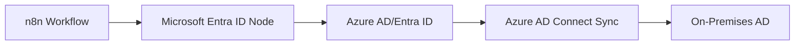
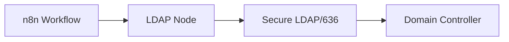
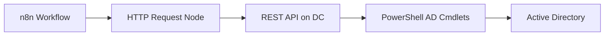
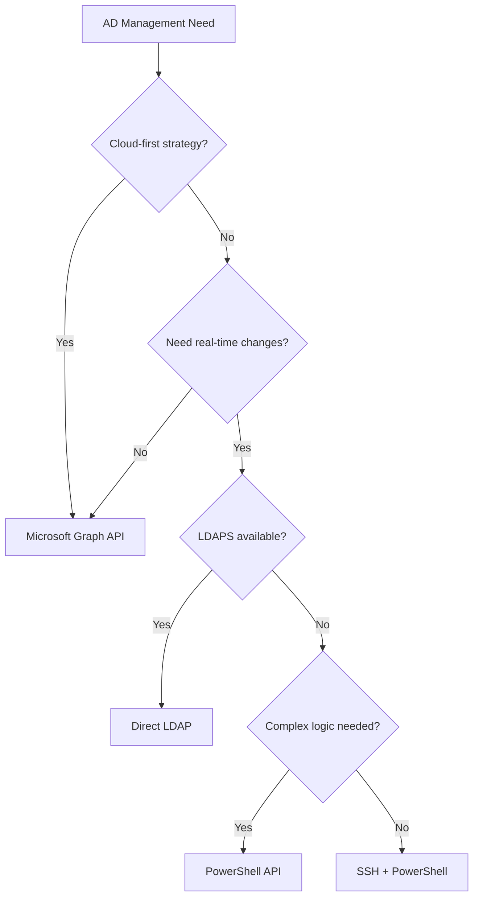

# Best Practices for Active Directory Management from n8n

## Executive Summary

For AD management from n8n in your hybrid environment (on-premises DC + Azure), the optimal approach depends on your specific requirements. Here are the best options ranked by effectiveness:

## 🏆 Top 3 Recommended Approaches

### 1. **Microsoft Graph API + Azure AD Connect (Hybrid Best Practice)**

**Why This is Best:** Microsoft's official modern approach for hybrid AD management.



**Implementation:**
```json
{
  "name": "Terminate Employee - Graph API",
  "nodes": [
    {
      "name": "Microsoft Entra ID",
      "type": "n8n-nodes-base.microsoftEntra",
      "parameters": {
        "resource": "user",
        "operation": "update",
        "userId": "={{ $json.employeeEmail }}",
        "updateFields": {
          "accountEnabled": false,
          "otherMails": ["terminated@company.com"]
        }
      }
    },
    {
      "name": "Remove from Groups",
      "type": "n8n-nodes-base.microsoftEntra",
      "parameters": {
        "resource": "user",
        "operation": "removeFromGroup",
        "userId": "={{ $json.employeeId }}",
        "groupId": "={{ $json.groupId }}"
      }
    }
  ]
}
```

**Advantages:**
- ✅ Cloud-native, no SSH/firewall issues
- ✅ Built-in n8n node support
- ✅ Automatic sync to on-premises AD
- ✅ Full audit trail in Azure
- ✅ Works from anywhere

**Setup Required:**
1. Configure Azure AD Connect for hybrid sync
2. Create Azure App Registration
3. Grant Microsoft Graph API permissions
4. Configure n8n Microsoft Entra ID credentials

---

### 2. **Direct LDAP Connection (Traditional Best Practice)**

**Why Consider This:** Direct, real-time AD management without dependencies.



**Implementation:**
```json
{
  "name": "Terminate Employee - LDAP",
  "nodes": [
    {
      "name": "Search User",
      "type": "n8n-nodes-base.ldap",
      "parameters": {
        "operation": "search",
        "baseDn": "DC=insulationsinc,DC=local",
        "searchFor": "User",
        "attribute": "Mail",
        "searchText": "={{ $json.employeeEmail }}"
      }
    },
    {
      "name": "Disable Account",
      "type": "n8n-nodes-base.ldap",
      "parameters": {
        "operation": "update",
        "dn": "={{ $json.distinguishedName }}",
        "updateAttributes": "replace",
        "attributes": {
          "userAccountControl": "514"  // Disabled account
        }
      }
    }
  ]
}
```

**Advantages:**
- ✅ Direct AD control, no sync delay
- ✅ Native n8n LDAP node
- ✅ No Azure dependencies
- ✅ Industry standard protocol

**Requirements:**
- Configure LDAPS (LDAP over SSL) on port 636
- Certificate for secure connection
- Firewall rule for LDAPS port
- Service account with appropriate AD permissions

---

### 3. **PowerShell REST API on DC (Custom Modern Approach)**

**Why Consider This:** Combines PowerShell's AD capabilities with modern API patterns.



**Implementation on DC:**
```powershell
# Install Pode (PowerShell REST API framework)
Install-Module -Name Pode -Force

# Create REST API
Start-PodeServer {
    Add-PodeEndpoint -Address * -Port 8080 -Protocol Http

    Add-PodeRoute -Method Post -Path '/api/user/disable' -ScriptBlock {
        param($e)
        $body = $e.Data | ConvertFrom-Json

        # Authenticate request
        if ($e.Headers['X-API-Key'] -ne $env:API_KEY) {
            Set-PodeResponseStatus -Code 401
            return
        }

        # Disable AD user
        Disable-ADAccount -Identity $body.employeeId
        Set-ADUser -Identity $body.employeeId -Description "Terminated: $(Get-Date)"

        Write-PodeJsonResponse @{
            success = $true
            message = "User $($body.employeeId) disabled"
        }
    }
}
```

**n8n Workflow:**
```json
{
  "name": "Call AD API",
  "type": "n8n-nodes-base.httpRequest",
  "parameters": {
    "url": "https://dc01.company.local:8443/api/user/disable",
    "method": "POST",
    "authentication": "genericCredentialType",
    "genericAuthType": "httpHeaderAuth",
    "sendHeaders": true,
    "headerParameters": {
      "parameters": [{
        "name": "X-API-Key",
        "value": "={{ $credentials.apiKey }}"
      }]
    },
    "sendBody": true,
    "bodyParameters": {
      "parameters": [{
        "name": "employeeId",
        "value": "={{ $json.employeeId }}"
      }]
    }
  }
}
```

**Advantages:**
- ✅ Full PowerShell AD cmdlet access
- ✅ RESTful API design
- ✅ Can implement complex logic
- ✅ Version control friendly

---

## Comparison Matrix

| Approach | Setup Complexity | Security | Reliability | Maintenance | Real-time | n8n Native |
|----------|-----------------|----------|-------------|-------------|-----------|------------|
| **Microsoft Graph API** | Medium | Excellent | High | Low | No (sync delay) | Yes |
| **Direct LDAP** | Low | Good | High | Low | Yes | Yes |
| **PowerShell API** | High | Good | High | Medium | Yes | HTTP Request |
| **SSH + PowerShell** | Medium | Medium | Medium | High | Yes | Yes |
| **Azure Automation** | High | Excellent | High | Low | No | HTTP Request |

## Decision Tree



## Detailed Implementation Guide

### Option 1: Microsoft Graph API (Recommended)

**Step 1: Configure Azure AD Connect**
```powershell
# On Domain Controller
# Download and install Azure AD Connect
# Configure hybrid identity sync
```

**Step 2: Create App Registration**
```bash
# Azure CLI
az ad app create --display-name "n8n-ad-management" \
  --required-resource-accesses @manifest.json

# Grant permissions
az ad app permission admin-consent --id <app-id>
```

**Step 3: n8n Credential Setup**
- Type: Microsoft OAuth2
- Client ID: From app registration
- Client Secret: Generated in Azure
- Tenant ID: Your Azure tenant
- Resource: https://graph.microsoft.com

**Step 4: Example Workflow**
```json
{
  "name": "Complete Employee Termination",
  "nodes": [
    {
      "name": "Get User",
      "type": "n8n-nodes-base.microsoftEntra",
      "parameters": {
        "resource": "user",
        "operation": "get",
        "userId": "={{ $json.employeeEmail }}"
      }
    },
    {
      "name": "Disable Account",
      "type": "n8n-nodes-base.microsoftEntra",
      "parameters": {
        "resource": "user",
        "operation": "update",
        "userId": "={{ $json.id }}",
        "updateFields": {
          "accountEnabled": false
        }
      }
    },
    {
      "name": "Remove from All Groups",
      "type": "n8n-nodes-base.code",
      "parameters": {
        "language": "javascript",
        "code": "// Get all group memberships and remove\nconst groups = $input.item.json.memberOf;\nreturn groups.map(group => ({\n  json: {\n    userId: $input.item.json.id,\n    groupId: group.id\n  }\n}));"
      }
    },
    {
      "name": "Remove Group Membership",
      "type": "n8n-nodes-base.microsoftEntra",
      "parameters": {
        "resource": "user",
        "operation": "removeFromGroup",
        "userId": "={{ $json.userId }}",
        "groupId": "={{ $json.groupId }}"
      }
    }
  ]
}
```

### Option 2: Direct LDAP Setup

**Step 1: Enable LDAPS on Domain Controller**
```powershell
# Install AD Certificate Services
Install-WindowsFeature AD-Certificate -IncludeManagementTools

# Create certificate template
# Configure LDAPS on port 636

# Test LDAPS
Test-NetConnection -ComputerName dc01.company.local -Port 636
```

**Step 2: Create LDAP Service Account**
```powershell
# Create service account for n8n
New-ADUser -Name "svc-n8n-ldap" `
  -UserPrincipalName "svc-n8n-ldap@insulationsinc.local" `
  -Enabled $true `
  -PasswordNeverExpires $true

# Grant necessary permissions
Add-ADGroupMember -Identity "Account Operators" -Members "svc-n8n-ldap"
```

**Step 3: n8n LDAP Credential**
- Connection URL: ldaps://dc01.company.local:636
- Bind DN: CN=svc-n8n-ldap,CN=Users,DC=insulationsinc,DC=local
- Bind Password: [Service account password]
- Start TLS: Enabled

### Option 3: PowerShell REST API

**Step 1: Install API Framework on DC**
```powershell
# Install Pode Server
Install-Module -Name Pode -Force

# Create API service
New-Service -Name "ADRestAPI" `
  -BinaryPathName "pwsh.exe -File C:\Scripts\AD-API.ps1" `
  -StartupType Automatic
```

**Step 2: Implement API Endpoints**
```powershell
# C:\Scripts\AD-API.ps1
Start-PodeServer -Threads 2 {
    Add-PodeEndpoint -Address * -Port 8443 -Protocol Https

    # Middleware for authentication
    Add-PodeMiddleware -Name 'ApiAuth' -ScriptBlock {
        param($e)
        $apiKey = $e.Headers['X-API-Key']
        if ($apiKey -ne $env:AD_API_KEY) {
            Set-PodeResponseStatus -Code 401
            return $false
        }
        return $true
    }

    # User operations
    Add-PodeRoute -Method Get -Path '/api/user/:id' -ScriptBlock {
        param($e)
        $user = Get-ADUser -Identity $e.Parameters.id -Properties *
        Write-PodeJsonResponse $user
    }

    Add-PodeRoute -Method Post -Path '/api/user/:id/disable' -ScriptBlock {
        param($e)
        Disable-ADAccount -Identity $e.Parameters.id
        Move-ADObject -Identity (Get-ADUser $e.Parameters.id).DistinguishedName `
          -TargetPath "OU=Disabled Users,DC=insulationsinc,DC=local"
        Write-PodeJsonResponse @{ success = $true }
    }
}
```

## Security Best Practices

### For All Approaches:
1. **Use Service Accounts** - Never use domain admin
2. **Implement Rate Limiting** - Prevent abuse
3. **Enable Audit Logging** - Track all changes
4. **Use Encryption** - TLS/SSL for all connections
5. **Rotate Credentials** - Regular password/key rotation
6. **Principle of Least Privilege** - Minimal required permissions

### Specific Security Configurations:

**Microsoft Graph API:**
```json
{
  "requiredResourceAccess": [{
    "resourceAppId": "00000003-0000-0000-c000-000000000000",
    "resourceAccess": [
      {
        "id": "user.readwrite.all",
        "type": "Role"
      },
      {
        "id": "group.readwrite.all",
        "type": "Role"
      }
    ]
  }]
}
```

**LDAP Permissions:**
```powershell
# Grant specific OU permissions only
$ou = "OU=Users,DC=insulationsinc,DC=local"
$acl = Get-Acl "AD:$ou"
$permission = New-Object System.DirectoryServices.ActiveDirectoryAccessRule(
    "svc-n8n-ldap",
    "GenericAll",
    "Allow",
    "Descendents"
)
$acl.AddAccessRule($permission)
Set-Acl "AD:$ou" $acl
```

## Monitoring and Alerting

```json
{
  "name": "AD Change Monitor",
  "trigger": "schedule",
  "nodes": [
    {
      "name": "Check Recent Changes",
      "type": "n8n-nodes-base.microsoftEntra",
      "parameters": {
        "resource": "auditLog",
        "operation": "list",
        "filters": {
          "category": "UserManagement",
          "activityDateTime": ">={{ $now.minus({hours: 1}).toISO() }}"
        }
      }
    },
    {
      "name": "Alert on Suspicious",
      "type": "n8n-nodes-base.if",
      "parameters": {
        "conditions": {
          "string": [{
            "value1": "={{ $json.activity }}",
            "operation": "contains",
            "value2": "Admin"
          }]
        }
      }
    }
  ]
}
```

## Conclusion

**For your specific situation:**
1. **If you have Azure AD Connect configured**: Use Microsoft Graph API (Option 1)
2. **If you need real-time on-premises changes**: Use Direct LDAP (Option 2)
3. **If you need complex PowerShell logic**: Build REST API (Option 3)
4. **Current SSH approach**: Valid but consider the above for better scalability

The Microsoft Graph API approach is generally recommended as it's:
- Future-proof
- Cloud-native
- Well-supported in n8n
- Provides the best security model

---

**Last Updated**: October 30, 2025
**Goal**: Enable reliable AD management from n8n
**Recommendation**: Start with Microsoft Graph API if Azure AD Connect is available