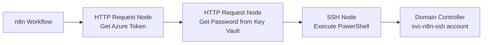

# n8n Best Practices Approach for Domain Controller Integration

## Recommended Architecture

### Primary Solution: Azure Key Vault + Service Account SSH

This approach aligns with n8n security best practices while providing reliable automation.



## Why This Approach Follows n8n Best Practices

### 1. **Credential Management**
- ✅ No hardcoded credentials in workflows
- ✅ Credentials stored in n8n's encrypted credential store
- ✅ Dynamic credential retrieval at runtime
- ✅ Supports credential rotation without workflow changes

### 2. **Security Principles**
- ✅ Principle of least privilege (service account, not Administrator)
- ✅ Encrypted credential storage (n8n uses AES-256)
- ✅ Audit trail in both Azure and n8n
- ✅ No secrets in workflow JSON exports

### 3. **Workflow Design**
- ✅ Modular node structure
- ✅ Error handling between nodes
- ✅ Idempotent operations
- ✅ Clear separation of concerns

## Implementation Details

### Step 1: Create Service Account on DC

```powershell
# Run the provided create-service-account.ps1 script
# This creates svc-n8n-ssh with minimal required permissions
```

### Step 2: Store Password in Azure Key Vault

```bash
# Create two secrets: one for password, one for fallback
az keyvault secret set \
  --vault-name iius-akv \
  --name "DC01-SVC-PASSWORD" \
  --value "ServiceAccountPassword"

# Optional: Store SSH private key as backup
az keyvault secret set \
  --vault-name iius-akv \
  --name "DC01-SVC-SSH-KEY" \
  --value "@/path/to/private/key"
```

### Step 3: n8n Workflow Configuration

```json
{
  "nodes": [
    {
      "name": "Get Azure Token",
      "type": "n8n-nodes-base.httpRequest",
      "parameters": {
        "url": "http://169.254.169.254/metadata/identity/oauth2/token",
        "method": "GET",
        "sendQuery": true,
        "queryParameters": {
          "parameters": [
            {
              "name": "api-version",
              "value": "2018-02-01"
            },
            {
              "name": "resource",
              "value": "https://vault.azure.net"
            }
          ]
        },
        "sendHeaders": true,
        "headerParameters": {
          "parameters": [
            {
              "name": "Metadata",
              "value": "true"
            }
          ]
        }
      }
    },
    {
      "name": "Get Service Account Password",
      "type": "n8n-nodes-base.httpRequest",
      "parameters": {
        "url": "https://iius-akv.vault.azure.net/secrets/DC01-SVC-PASSWORD?api-version=7.4",
        "method": "GET",
        "authentication": "none",
        "sendHeaders": true,
        "headerParameters": {
          "parameters": [
            {
              "name": "Authorization",
              "value": "=Bearer {{ $('Get Azure Token').item.json.access_token }}"
            }
          ]
        }
      }
    },
    {
      "name": "Execute PowerShell Command",
      "type": "n8n-nodes-base.ssh",
      "parameters": {
        "authentication": "password",
        "resource": "command",
        "operation": "execute",
        "command": "=powershell.exe -ExecutionPolicy Bypass -Command \"{{ $json.command }}\"",
        "cwd": "/"
      },
      "credentials": {
        "ssh": {
          "id": "dc-service-account",
          "name": "DC Service Account SSH"
        }
      }
    }
  ]
}
```

### Step 4: n8n SSH Credential Configuration

Create a new SSH credential in n8n with:
- **Name**: `DC Service Account SSH`
- **Host**: `10.0.0.200`
- **Port**: `22`
- **Username**: `svc-n8n-ssh`
- **Password**: `={{ $('Get Service Account Password').item.json.value }}`

## Alternative Patterns for Different Scenarios

### Pattern A: Retry Logic with Error Handling

```json
{
  "name": "Execute with Retry",
  "type": "n8n-nodes-base.ssh",
  "retryOnFail": true,
  "maxTries": 3,
  "waitBetweenTries": 5000,
  "continueOnFail": false,
  "parameters": {
    "authentication": "password",
    "resource": "command",
    "operation": "execute",
    "command": "powershell.exe -Command \"{{ $json.command }}\""
  }
}
```

### Pattern B: Sub-workflow for Reusability

Create a sub-workflow for DC operations:

```json
{
  "name": "Execute DC Command Sub-workflow",
  "nodes": [
    {
      "name": "Workflow Input",
      "type": "n8n-nodes-base.executeWorkflowTrigger",
      "parameters": {
        "workflowInputs": {
          "values": [
            {
              "name": "command",
              "type": "string"
            },
            {
              "name": "targetUser",
              "type": "string"
            }
          ]
        }
      }
    }
  ]
}
```

### Pattern C: Code Node for Complex Logic

When SSH isn't sufficient, use Code node with HTTP requests:

```javascript
// n8n Code node for complex DC operations
const axios = require('axios');

// Get token from Azure
const tokenResponse = await axios.get(
  'http://169.254.169.254/metadata/identity/oauth2/token',
  {
    params: {
      'api-version': '2018-02-01',
      'resource': 'https://vault.azure.net'
    },
    headers: { 'Metadata': 'true' }
  }
);

// Get password from Key Vault
const secretResponse = await axios.get(
  'https://iius-akv.vault.azure.net/secrets/DC01-SVC-PASSWORD',
  {
    params: { 'api-version': '7.4' },
    headers: { 'Authorization': `Bearer ${tokenResponse.data.access_token}` }
  }
);

// Return for use in next node
return {
  password: secretResponse.data.value,
  timestamp: new Date().toISOString()
};
```

## Security Enhancements

### 1. Implement Credential Rotation Workflow

```json
{
  "name": "Password Rotation Workflow",
  "trigger": "n8n-nodes-base.scheduleTrigger",
  "schedule": {
    "cronExpression": "0 0 1 */3 *"  // Every 3 months
  },
  "nodes": [
    {
      "name": "Generate New Password",
      "type": "n8n-nodes-base.code",
      "language": "javascript",
      "code": "const crypto = require('crypto');\nreturn { password: crypto.randomBytes(20).toString('base64') };"
    },
    {
      "name": "Update AD Password",
      "type": "n8n-nodes-base.ssh",
      "command": "Set-ADAccountPassword -Identity svc-n8n-ssh -NewPassword (ConvertTo-SecureString '{{ $json.password }}' -AsPlainText -Force) -Reset"
    },
    {
      "name": "Update Key Vault",
      "type": "n8n-nodes-base.httpRequest",
      "url": "https://iius-akv.vault.azure.net/secrets/DC01-SVC-PASSWORD"
    }
  ]
}
```

### 2. Audit Logging Pattern

```json
{
  "name": "Audit Log",
  "type": "n8n-nodes-base.httpRequest",
  "parameters": {
    "url": "https://your-logging-endpoint.com/audit",
    "method": "POST",
    "body": {
      "timestamp": "={{ $now.toISO() }}",
      "workflow": "={{ $workflow.name }}",
      "execution": "={{ $executionId }}",
      "action": "DC_COMMAND_EXECUTION",
      "user": "={{ $json.targetUser }}",
      "command": "={{ $json.command.substring(0, 100) }}"
    }
  }
}
```

## Error Handling Best Practices

### 1. Use Error Workflow

```json
{
  "settings": {
    "errorWorkflow": "workflow_error_handler_id"
  }
}
```

### 2. Implement Circuit Breaker Pattern

```javascript
// Code node for circuit breaker
const failures = $getWorkflowStaticData('failures') || 0;
const lastFailure = $getWorkflowStaticData('lastFailure') || 0;
const now = Date.now();

// Reset after 5 minutes
if (now - lastFailure > 300000) {
  $setWorkflowStaticData('failures', 0);
}

// Fail fast if too many recent failures
if (failures > 3) {
  throw new Error('Circuit breaker open - too many failures');
}

try {
  // Attempt operation
  return items;
} catch (error) {
  $setWorkflowStaticData('failures', failures + 1);
  $setWorkflowStaticData('lastFailure', now);
  throw error;
}
```

## Monitoring and Observability

### 1. Health Check Workflow

```json
{
  "name": "DC Connection Health Check",
  "trigger": "n8n-nodes-base.scheduleTrigger",
  "schedule": { "cronExpression": "*/15 * * * *" },
  "nodes": [
    {
      "name": "Test SSH Connection",
      "type": "n8n-nodes-base.ssh",
      "command": "echo 'health check'",
      "continueOnFail": true
    },
    {
      "name": "Alert on Failure",
      "type": "n8n-nodes-base.if",
      "conditions": {
        "boolean": [
          {
            "value1": "={{ $node['Test SSH Connection'].error }}",
            "value2": "={{ undefined }}"
          }
        ]
      }
    }
  ]
}
```

### 2. Performance Metrics

```javascript
// Code node for performance tracking
const start = Date.now();

// Your operation here

const duration = Date.now() - start;

// Log to monitoring system
if (duration > 5000) {
  // Alert on slow operations
  console.warn(`Slow DC operation: ${duration}ms`);
}

return { duration, timestamp: new Date().toISOString() };
```

## Testing Strategy

### 1. Test Workflow

```json
{
  "name": "Test DC Integration",
  "nodes": [
    {
      "name": "Test Commands",
      "type": "n8n-nodes-base.code",
      "code": "return [\n  { command: 'whoami' },\n  { command: 'hostname' },\n  { command: 'Get-Date' }\n];"
    },
    {
      "name": "Execute Tests",
      "type": "n8n-nodes-base.ssh",
      "command": "powershell.exe -Command \"{{ $json.command }}\""
    },
    {
      "name": "Validate Results",
      "type": "n8n-nodes-base.if",
      "conditions": {
        "string": [
          {
            "value1": "={{ $json.stdout }}",
            "operation": "contains",
            "value2": "svc-n8n"
          }
        ]
      }
    }
  ]
}
```

## Migration Path from Current State

### Phase 1: Complete Current Implementation (1-2 days)
1. Fix AKS resource constraints
2. Test Key Vault integration with Administrator account
3. Verify basic functionality

### Phase 2: Implement Service Account (3-4 days)
1. Run create-service-account.ps1 script
2. Test SSH with service account
3. Update workflows to use service account

### Phase 3: Production Hardening (1 week)
1. Implement password rotation workflow
2. Add monitoring and alerting
3. Create error handling workflows
4. Document runbooks

## Key Advantages of This Approach

1. **n8n Native**: Uses built-in nodes, no custom code required
2. **Secure**: No credentials in workflow definitions
3. **Maintainable**: Clear, modular workflow structure
4. **Scalable**: Can handle multiple DC operations
5. **Auditable**: Full execution history in n8n
6. **Resilient**: Built-in retry and error handling
7. **Testable**: Easy to test individual components

## Common Pitfalls to Avoid

1. ❌ Don't hardcode credentials in workflows
2. ❌ Don't use Administrator account for automation
3. ❌ Don't skip error handling
4. ❌ Don't ignore execution timeouts
5. ❌ Don't forget to implement monitoring
6. ❌ Don't neglect password rotation
7. ❌ Don't bypass audit logging

## Support Resources

- n8n SSH Node Documentation: https://docs.n8n.io/integrations/builtin/app-nodes/n8n-nodes-base.ssh/
- n8n Credentials: https://docs.n8n.io/credentials/
- Azure Key Vault REST API: https://docs.microsoft.com/en-us/rest/api/keyvault/
- n8n Community Forum: https://community.n8n.io/

---

**Last Updated**: October 30, 2025
**Version**: 1.0
**Status**: Recommended Implementation